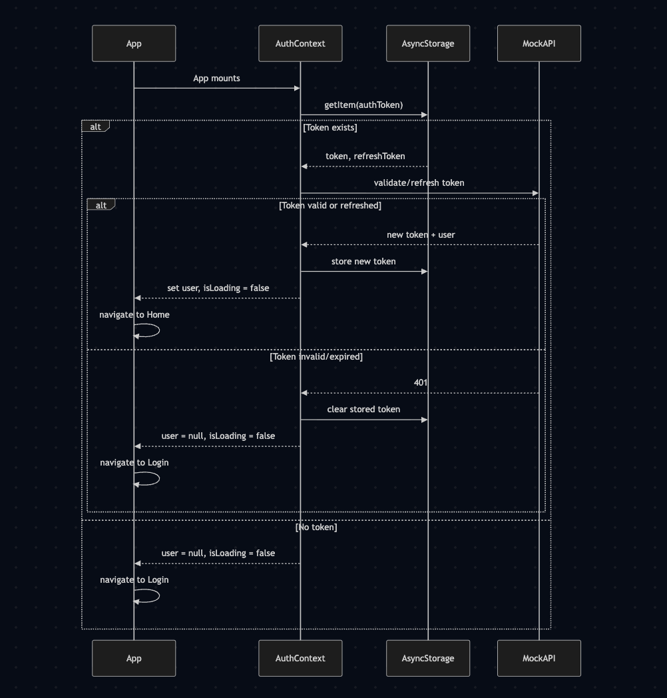
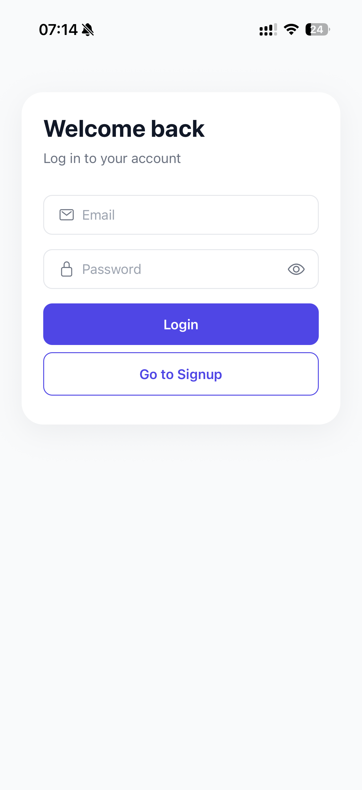
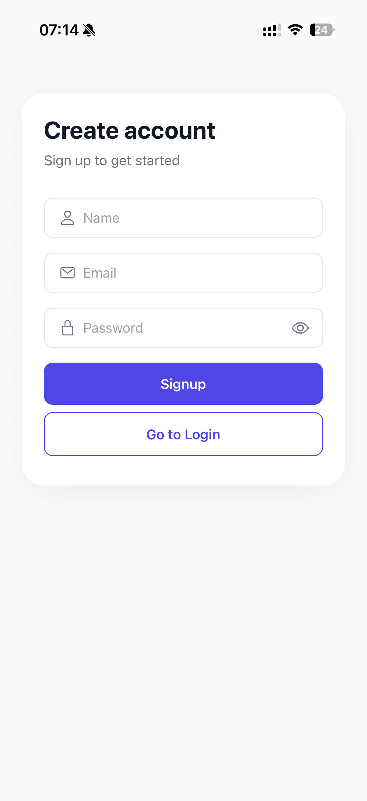
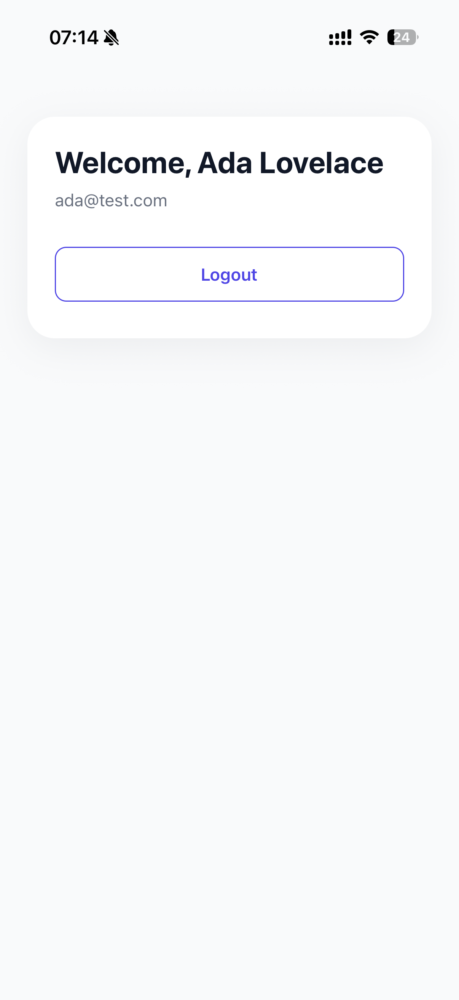

# AuthApp

A React Native (Expo) authentication app implementing Login, Signup, and Home
screens with global auth state managed through React's Context API.

## Overview

For this assignment, I built AuthApp around:

- **React Native + Expo** for the app
- **React Context API** (`AuthContext`) for global auth state
- **React Navigation** for screen transitions
- **AsyncStorage** for session persistence across app restarts
- A **mock backend** (`mock-user-store.ts`) simulating account storage

> **Note:** the visual styling/UI polish (card layouts, input icons, spacing) was
> generated with the help of Claude Code. The
> architecture, logic, and decisions throughout this README are my own.

---

## Setup Instructions

### Prerequisites

- Node.js (`^18.14.0 || ^20.0.0 || ^22.0.0 || >=24.0.0`)
- npm
- Expo Go app (iOS/Android) or a simulator/emulator

### Install & run

```bash
npm install
npm start
```

### Other scripts

```bash
npm test       # run the Jest unit test suite
npm run ios    # start directly on iOS simulator
npm run android
```

---

## Features Implementation

| Requirement                                                      | Where                                                                  |
| ---------------------------------------------------------------- | ---------------------------------------------------------------------- |
| `AuthContext` (`user`, `login`, `signup`, `logout`)              | [`src/context/auth-context.tsx`](src/context/auth-context.tsx)         |
| Login screen (email/password, validation, error states)          | [`src/screens/login-screen.tsx`](src/screens/login-screen.tsx)         |
| Signup screen (name/email/password, validation, error states)    | [`src/screens/signup-screen.tsx`](src/screens/signup-screen.tsx)       |
| Home screen (user info + logout)                                 | [`src/screens/home-screen.tsx`](src/screens/home-screen.tsx)           |
| Navigation (auth-state-based stack switching)                    | [`src/navigation/app-navigator.tsx`](src/navigation/app-navigator.tsx) |
| Session persistence via AsyncStorage                             | [`src/context/auth-context.tsx`](src/context/auth-context.tsx)         |
| Password visibility toggle (bonus)                               | [`src/components/input-field.tsx`](src/components/input-field.tsx)     |
| Form validation (email format, password length, required fields) | [`src/utils/validation.ts`](src/utils/validation.ts)                   |
| Native logout confirmation dialog (bonus)                        | [`src/screens/home-screen.tsx`](src/screens/home-screen.tsx)           |

---

## Architecture & Key Decisions

- **Context API over Redux/Zustand** — I chose Context API because the assignment
  scope (3 screens, one piece of shared state) doesn't justify pulling in a state
  management library. `AuthContext` exposes `user`, `loading`, `login`, `signup`,
  and `logout` to the tree via a single provider (`AuthProvider`) wrapping the
  navigator in [`App.tsx`](App.tsx).
- **Auth-state-driven navigation** — rather than manually calling
  `navigation.reset()` after login/logout, I had [`AppNavigator`](src/navigation/app-navigator.tsx)
  conditionally render the `Login`/`Signup` screens or the `Home` screen based on
  whether `user` is set. This is the idiomatic React Navigation pattern for
  auth flows and avoids stale navigation stacks.
- **Mock backend, not a real API** — I simulated a user table using AsyncStorage
  in [`mock-user-store.ts`](src/services/mock-user-store.ts) (`findAccountByEmail`,
  `createAccount`). This keeps the app runnable with zero backend setup, at the
  cost of not exercising real network/async-error handling.
- **Simulated session tokens** — in [`token-utils.ts`](src/utils/token-utils.ts)
  I generate a mock access/refresh token pair with a 15-minute expiry and
  silently "refresh" it on session restore if expired. This wasn't required by
  the assignment, but I added it to demonstrate how the context would slot into
  a real token-based backend later.
- **Memoized context value** — I wrapped `login`/`signup`/`logout` in
  `useCallback`, and the provider's context value in `useMemo`, so consumers of
  `useAuth()` don't re-render on unrelated provider re-renders.
- **Shared UI primitives** — I kept `InputField` and `PrimaryButton` as the only
  two reusable components; every screen composes from them instead of
  duplicating `TextInput`/`Pressable` styling.
- **Native confirmation on logout** — I used React Native's `Alert.alert` API
  in [`home-screen.tsx`](src/screens/home-screen.tsx) to show a native
  iOS/Android confirmation dialog before logging out, rather than a custom JS
  modal, so it renders as a platform-native alert on each OS.

### Sequence diagram

<!-- Paste your sequence diagram image here, e.g.: -->



---

## Naming Convention

- **Files:** I used kebab-case throughout (`auth-context.tsx`, `login-screen.tsx`,
  `mock-user-store.ts`) — following the modern Expo recommendation
- **Folders:** I grouped files by role, not by feature — `screens/`, `components/`,
  `context/`, `services/`, `utils/`, `types/`, `styles/` — which felt right at
  this app's size (3 screens); I'd move to feature-based folders if it grew.

---

## Developer Workflow

- **Branch naming:** I used `feat/…` for new functionality, `chore/…` for
  tooling/config changes, `refactor/…` for internal changes with no behavior
  difference (e.g. `feat/ui-polish`, `chore/add-git-prehook`,
  `refactor/memoize-auth-context`).
- **Pre-commit hook:** I set up [Husky](https://typicode.github.io/husky/) to run
  the Jest suite (`npm test`) before every commit, so a failing test can't be
  committed.
- **Code review:** I ran pull requests through **CodeRabbit (free tier)** for
  automated PR summaries and first-pass review comments before merging.
- **Commit hygiene:** I squash-merged feature branches into `main` so each
  merged PR corresponds to a single, readable commit in history.

---

## Assumptions

- I assumed no real backend was available or required — accounts and sessions
  are simulated entirely on-device via AsyncStorage.
- I stored passwords in plaintext in the mock store; acceptable only because
  there's no real backend and nothing ever leaves the device. A real backend
  would hash passwords server-side.
- I check email uniqueness case-insensitively; two accounts can't share an
  email regardless of casing.
- I set a signed-in session to expire after 15 minutes (mock TTL) and silently
  refresh it on next app open rather than forcing re-login, to mimic a real
  refresh-token flow.

---

## Out of Scope

- Real backend / REST API integration
- Password reset / forgot-password flow
- Social login (Google, Apple, etc.)
- Multi-factor authentication
- Native module or platform-specific (iOS/Android bridge) code — the assignment is a pure cross-platform JS/TS screen set

---

## Testing

I wrote unit tests with Jest (`jest-expo` preset) covering the pure logic
layer:

- [`validation.test.ts`](src/utils/validation.test.ts) — email/password format
  rules, login/signup form validators
- [`token-utils.test.ts`](src/utils/token-utils.test.ts) — mock token
  generation, expiry checks, refresh behavior
- [`mock-user-store.test.ts`](src/services/mock-user-store.test.ts) — account
  creation and lookup against the mock store

Run with:

```bash
npm test
```

I didn't write UI/component or end-to-end tests — out of scope for this
assignment's time budget; `@testing-library/react-native` is already installed
if I add that coverage later.

---

## Screenshots / Demo Video

| Login                               | Signup                                | Home                              |
| ----------------------------------- | ------------------------------------- | --------------------------------- |
|  |  |  |

[Demo video](docs/auth-app-video-demo.mp4)

---

## Trade-offs

- **AsyncStorage instead of SecureStore/Keychain** — chosen for zero extra
  setup in a mock/no-backend app; a production app must store tokens in
  `expo-secure-store` or `react-native-keychain` instead, since AsyncStorage
  is unencrypted on disk.
- **No feature-based folder structure** — I kept a flat, role-based `src/`
  layout since it's simpler to navigate at 3 screens; it would need
  restructuring before scaling to a larger app.
- **Flat state management** — Context API is the right size for this app's
  scope, but I'd move to a dedicated state library if the number of shared
  state slices grew significantly.
